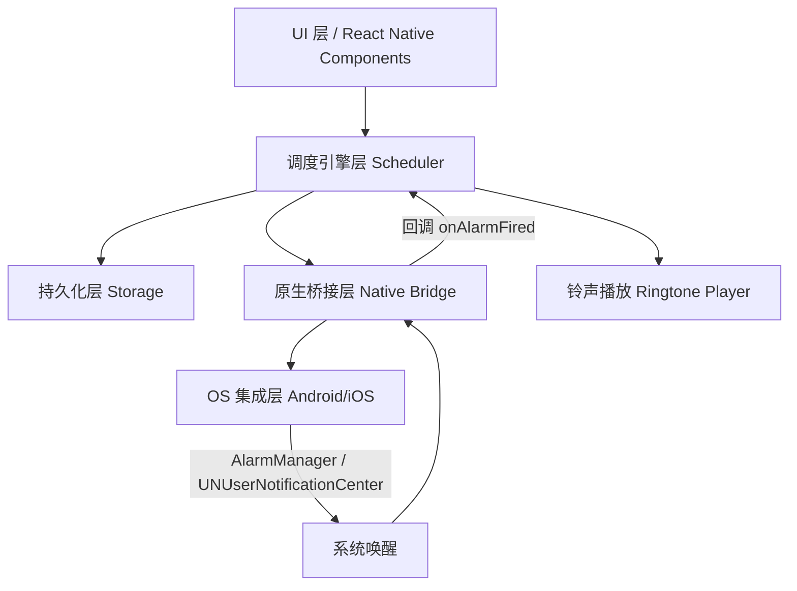

# 跨平台定时闹钟应用 · 框架/架构设计

> TL;DR
> - **推荐技术栈**：React Native（bare workflow）+ TypeScript，共享调度逻辑用 TS，精确定时与本地铃声用 Kotlin/Swift 原生模块桥接。Flutter 为等价备选。
> - **核心难点**：iOS 在 App 被杀死后无法播放超 30s 自定义铃声，必须接受系统通知音频上限或采用 Silent-Audio 保活降级方案；Android 可用 AlarmManager + 前台 Service 实现可靠响铃。
> - **周期模型**：采用"锚点 + 间隔"混合表达式（扩展 RRULE），统一表达年/月/日/时/分/秒任意周期，由纯函数 `nextTrigger()` 计算下次触发时间。
> - **架构**：UI 层 / 调度引擎层 / 持久化层 / 原生桥接层 / OS 集成层 五层，双端共享上层、原生仅下沉到"精确唤醒 + 播放"。

---

## 1. 框架/技术栈选型

| 方案 | 优点 | 缺点 | 精确定时/铃声可行性 |
|------|------|------|----------------------|
| **React Native (bare) + TS** ✅推荐 | 共享逻辑用 TS；生态成熟（`react-native-alarm-manager`、`expo-notifications`）；原生模块用 Kotlin/Swift 写，控制力强 | 需要原生构建环境（Xcode/Android Studio）；bridge 有学习成本 | Android 完美；iOS 受系统上限约束（见 §5） |
| **Flutter + Dart** | 单语言跨端；UI 一致性强；`android_alarm_manager_plus` + `flutter_local_notifications` 成熟 | iOS 后台音频同样受限；Dart 原生 channel 需分别写 | 与 RN 等价，iOS 边界一致 |
| **原生双端（Kotlin + SwiftUI）** | 能力天花板最高，无 bridge 损耗 | 开发成本 ×2，维护两套 | 最完整，但违背"一套代码双端"诉求 |

**结论**：选 **React Native (bare workflow) + TypeScript**。理由：
1. 调度计算、周期模型、存储、UI 全用 TS 共享，避免双端重复实现；
2. 仅"精确唤醒 + 播放铃声"下沉为原生模块，且这部分双端本就不同；
3. 后续接入推送、Widget、通知扩展都有现成生态。

> 备选：若团队更熟悉 Dart，Flutter 可 1:1 替换，架构分层完全通用。

---

## 2. 系统架构分层



| 层 | 职责 | 是否跨端共享 |
|----|------|--------------|
| UI 层 | 闹钟列表、编辑表单、到点响铃页 | ✅ 共享 (RN) |
| 调度引擎层 | 周期解析、nextTrigger 计算、闹钟生命周期管理 | ✅ 共享 (TS) |
| 持久化层 | 闹钟 CRUD、下次触发时间缓存 | ✅ 共享 (MMKV/SQLite) |
| 原生桥接层 | 向系统注册精确闹钟、接收系统唤醒、播放本地铃声 | ❌ 双端各写 (Kotlin/Swift) |
| OS 集成层 | Android AlarmManager / iOS UNUserNotificationCenter、音频会话 | ❌ 系统原生 |

---

## 3. 周期性闹钟数据模型

采用**「锚点时间 + 周期字段」**混合表达，兼容 RRULE 思路且扩展到"秒/分/时"粒度，覆盖"每天 08:30:00""每月1号""每年1月1日""每 15 分钟"等任意组合。

```typescript
type Frequency =
  | 'once'        // 单次：仅 fireAt
  | 'second' | 'minute' | 'hour'   // 固定间隔（带 interval）
  | 'day' | 'week' | 'month' | 'year';

interface Alarm {
  id: string;
  label: string;
  enabled: boolean;
  fireAt: number;          // 首次触发时间戳(ms, UTC)，用于 once 与锚点
  freq: Frequency;
  interval?: number;       // freq 为 second/minute/hour 时的间隔倍数(>=1)
  byWeekday?: number[];    // 0-6，freq='week' 时生效（周几）
  byMonthday?: number[];   // 1-31，freq='month' 时生效（几号）
  byMonth?: number[];      // 1-12，freq='year' 时生效（几月）
  sound: string;           // 铃声资源标识（res/raw 或 bundle）
  vibrate: boolean;
  snooze?: number;         // 贪睡分钟，0=不贪睡
  nextTrigger?: number;    // 缓存的下次触发时间(ms)，引擎维护
  timezone: string;        // IANA，如 'Asia/Shanghai'
}

/** 纯函数：根据当前时间与闹钟定义，计算下一次触发时间戳(ms) */
declare function nextTrigger(alarm: Alarm, from: number): number;
```

**nextTrigger 计算思路**（引擎核心，纯 TS 可单测）：
1. `once`：直接返回 `fireAt`，已过则标记完成。
2. 间隔类（second/minute/hour）：从 `max(fireAt, from)` 起按 `interval` 步进，返回首个 `> from` 的值。
3. 日历类（day/week/month/year）：在锚点时间基础上，按日历字段（周几/几号/几月）向前推进到下一个满足条件的时间点，期间处理跨月/跨年与时区换算。
4. 所有计算基于 `alarm.timezone`，避免设备时区变更导致误触发。

---

## 4. 跨平台策略（共享 vs 原生边界）

| 模块 | 实现位置 | 说明 |
|------|----------|------|
| 周期模型 / nextTrigger | 共享 TS | 纯函数，双端完全一致，可单测 |
| 闹钟增删改查 / 存储 | 共享 TS | MMKV 或 SQLite（如 `react-native-mmkv`） |
| 列表/编辑/响铃 UI | 共享 RN | 一套组件双端渲染 |
| 向系统注册"精确唤醒" | 原生 | Android `AlarmManager` / iOS `UNUserNotificationCenter` |
| 接收系统唤醒并回调 JS | 原生 | 原生 Module 暴露 `onAlarmFired` 事件 |
| 播放本地铃声（含 App 被杀） | 原生 | Android 前台 Service + MediaPlayer；iOS 通知音频/AVAudioSession |
| 权限申请（电池优化/通知） | 原生 + RN 壳 | 引导用户加白名单 |

---

## 5. 原生桥接设计（双端能力差异是重点）

### Android（能力强，可做到"被杀也响铃"）
- **注册**：`AlarmManager.setExactAndAllowWhileIdle()`（API≥23）或 `setAlarmClock()`（最高优先级，锁屏也响），传入 `PendingIntent`。
- **唤醒**：系统到点拉起 `BroadcastReceiver` → 启动 **前台 Service**（必须展示通知渠道，Android 8+）→ `MediaPlayer`/`ExoPlayer` 播放 `res/raw` 下自定义铃声，支持循环/渐强/振动。
- **可靠性的关键**：引导用户将 App 加入**电池优化忽略白名单**（`REQUEST_IGNORE_BATTERY_OPTIMIZATIONS`），否则 Doze 会延迟闹钟。
- **能力上限**：几乎无限制，可实现任意时长、自定义音频、振动、渐强。

### iOS（系统限制严格，必须降级）
- **注册**：`UNUserNotificationCenter.add(_:withCompletionHandler:)` 添加**本地通知**，指定 `trigger.dateComponents` 与重复规则（`Calendar`/`TimeInterval`）。
- **铃声限制（关键）**：
  - 通知声音**必须打包进 App（Bundle）**，不支持运行时从沙盒/网络加载任意音频；
  - 单个声音文件**最长 30 秒**，且必须为线性 PCM/IMA4/MP3/AAC，**无法循环超过 30s**；
  - App 被**用户手动杀死（swipe-kill）后，iOS 不再投递任何通知**（包括本地通知）——这是系统级限制，无法绕过。
- **降级策略（三选一，需产品拍板）**：
  1. **接受方案**：铃声 ≤30s、打包内置若干音效；App 在前台/后台挂起态可正常响；被杀则失效（多数闹钟 App 现状）。
  2. **Silent-Audio 保活**：用无声音频 + `AVAudioSession` 后台播放维持进程，到点切到响铃——可被系统回收，不保证，且耗电、上架有拒审风险。
  3. **Critical Alert（关键警报）**：`UNNotificationServiceExtension` + 授权 `criticalAlert`，**无视静音/勿扰、可超 30s**，但需苹果特殊 entitlement（仅特定品类如医疗/安防易过审，普通闹钟难拿到）。

> ⚠️ **结论**：Android 端可做到"可靠精确定时 + 任意铃声"；iOS 端必须在"30s 打包铃声 + 被杀失效"与"申请 Critical Alert"之间做取舍。这是本项目最大的跨端不一致点，需在需求阶段定调。

---

## 6. 文件结构（React Native bare 示例）

```
alarm-clock/
├─ App.tsx                      # 入口，注册原生模块与引擎
├─ src/
│  ├─ engine/
│  │  ├─ types.ts               # Alarm / Frequency 等类型（§3）
│  │  ├─ nextTrigger.ts         # 纯函数：下次触发计算（可单测）
│  │  ├─ scheduler.ts           # 闹钟生命周期、与原生桥接编排
│  │  └─ recurrence.test.ts     # nextTrigger 单元测试
│  ├─ storage/
│  │  └─ alarmStore.ts          # MMKV/SQLite 封装
│  ├─ native/
│  │  └─ AlarmBridge.ts         # RN 侧调用原生模块（register/cancel/onFired）
│  └─ ui/
│     ├─ AlarmList.tsx          # 闹钟列表
│     ├─ AlarmEditor.tsx        # 周期/铃声/贪睡编辑
│     └─ RingScreen.tsx         # 到点响铃页
├─ android/
│  └─ app/src/main/java/.../alarm/
│     ├─ AlarmModule.kt         # ReactNativeModule：注册/取消/回调
│     ├─ AlarmReceiver.kt       # BroadcastReceiver
│     ├─ AlarmService.kt        # 前台 Service 播放铃声
│     └─ res/raw/*.mp3          # 内置铃声
└─ ios/
   └─ AlarmBridge/
      ├─ AlarmModule.swift      # RCTBridgeModule
      ├─ AlarmScheduler.swift   # UNUserNotificationCenter 封装
      └─ Sounds.xcassets        # 打包铃声(≤30s)
```

---

## 7. 任务分解（建议实现顺序）

| # | 任务 | 依赖 | 优先级 |
|---|------|------|--------|
| T1 | 搭建 RN bare 工程 + 双端构建环境 | — | P0 |
| T2 | 定义 `types.ts` 与 `nextTrigger.ts`（周期模型） | T1 | P0 |
| T3 | `recurrence.test.ts` 覆盖年/月/日/周/间隔/时区 | T2 | P0 |
| T4 | `alarmStore.ts` 持久化 + `scheduler.ts` 编排 | T2 | P0 |
| T5 | Android 原生：AlarmModule + Receiver + 前台 Service + 播放 | T4 | P0 |
| T6 | iOS 原生：AlarmModule + UNUserNotificationCenter 注册/回调 | T4 | P0 |
| T7 | UI：列表 / 编辑器（周期表单）/ 响铃页 | T4 | P1 |
| T8 | 权限引导：Android 电池白名单、iOS 通知授权 | T5/T6 | P1 |
| T9 | 铃声资源管理 + 贪睡/振动/渐强（Android 完整，iOS 按降级） | T5/T6 | P1 |
| T10 | 端到端联调 + QA 测试 | T7-T9 | P0 |

---

## 8. 依赖包清单

| 类别 | 包 | 用途 |
|------|----|------|
| 基础 | `react`, `react-native` | 框架 |
| 存储 | `react-native-mmkv` 或 `@react-native-sqlite-storage` | 闹钟持久化 |
| 桥接辅助 | `react-native-alarm-manager`（参考/改写） | Android 精确闹钟（也可自写） |
| 通知 | `react-native-notifications` / `expo-notifications` | iOS 本地通知封装 |
| 工具 | `date-fns` / `luxon` | 时区与日历计算 |
| 测试 | `jest` + `ts-jest` | nextTrigger 单测 |
| 原生(Android) | `androidx.work`, `exoplayer` | 前台服务/播放 |
| 原生(iOS) | `UserNotifications.framework`, `AVFoundation` | 通知/音频 |

---

## 9. 共享约定（跨文件）

- **时区**：所有 `fireAt`/`nextTrigger` 内部以 **UTC(ms)** 存储，展示时按 `alarm.timezone` 转换；设备时区变更不影响已设闹钟。
- **nextTrigger 算法**：纯函数、无副作用、可单测；引擎在"新增/修改/触发后"三个时机重算并写回 `alarm.nextTrigger`。
- **存储 key**：`alarm:<id>` 单条；`alarm:index` 存 id 列表；`meta:nextScan` 存下次全量扫描时间。
- **原生事件**：原生 → JS 统一通过 `AlarmBridge.onFired(alarmId)` 回调，JS 侧据此拉起 `RingScreen` 并播放。
- **失败兜底**：App 启动时扫描所有 `nextTrigger<=now+窗口` 的闹钟，向系统重新注册，防止进程被杀后丢失。

---

## 10. 待明确事项（需产品/你拍板）

1. **iOS 铃声策略**：接受「≤30s 打包铃声 + App 被杀失效」（方案1），还是要尝试「Critical Alert 上架申请」（方案3）？——决定 iOS 架构走向。
2. **附加功能范围**：是否需要 贪睡 / 振动 / 音量渐强 / 标签分组 / 渐变灯光？影响 UI 与原生播放复杂度。
3. **铃声来源**：仅内置若干铃声，还是允许用户从本机音乐导入（iOS 导入也受沙盒限制）？
4. **技术栈确认**：React Native（推荐）还是 Flutter？影响全部文件结构。
5. **上架目标**：仅内部分发（企业签/TestFlight）还是 App Store 正式上架？决定能否用 Silent-Audio 等擦边方案。

---

## 下一步建议（若进入实现阶段）

1. 先 **T1–T3**：用 `npm` 起 RN bare 工程，把 `types.ts` + `nextTrigger.ts` + 单测跑通——这是风险最低、价值最高的起点，且完全跨端、无需原生环境。
2. 同步 **T5/T6** 原生桥接可并行由两个平台工程师分头写（Android 与 iOS 互不阻塞）。
3. 我（主理人）会据此把任务清单转交工程师 寇豆码 批量实现，再由 QA 严过关 对 `nextTrigger` 与端到端触发做测试。
